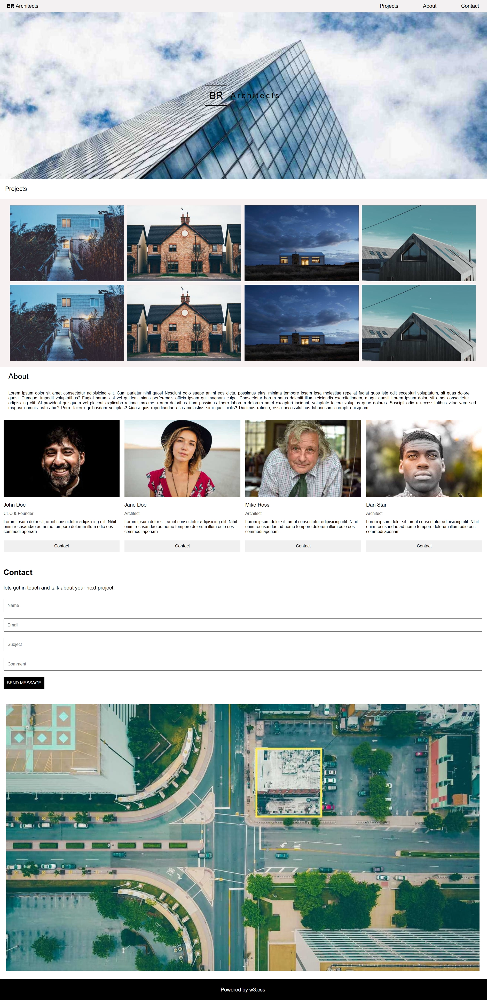

# Responsive Design Projects

Welcome to my **Responsive Design Projects** repository! this repo showcases **4 modern and fully responsive web projects** built using **HTML and CSS**.
These projects adopt smoothly to **desktop, tablet, and mobile screens**.

---

## Projects Overview

### 1. Architect Template
A sleek responsive website template for architecture portfolios.
built using **HTML & CSS**, fully responsive for all devices.



### 2. Gourmet Catering Template
A beautiful responsive template for catering or food service businesses.
Designed with **HTML & CSS**, mobile-friendly and easy to customize.


### 3. Nature Portfolio Template
A nature-inspired responsive portfolio template.
Create using **HTML & CSS**, optimized for desktops, tablets, and mobiles.


### 4. Responsive Navbar
A responsive navigation bar with dropdowns and mobile-friendly layout.
Implemented using **HTML & CSS only**, perfect for any website.


---

## Features

- Fully responsive design using **Flexbox**, **CSS Grid**, and **media queries**
- Mobile-first approach for better usability on all devices
- Clean and modern UI/UX
- Easy to **customize and reuse** for your own projects

---

## How to Run Locally

1. Clone this repository:
```bash
git clone https://github.com/kajalSaini0017/Responsive-Design-Projects.git
